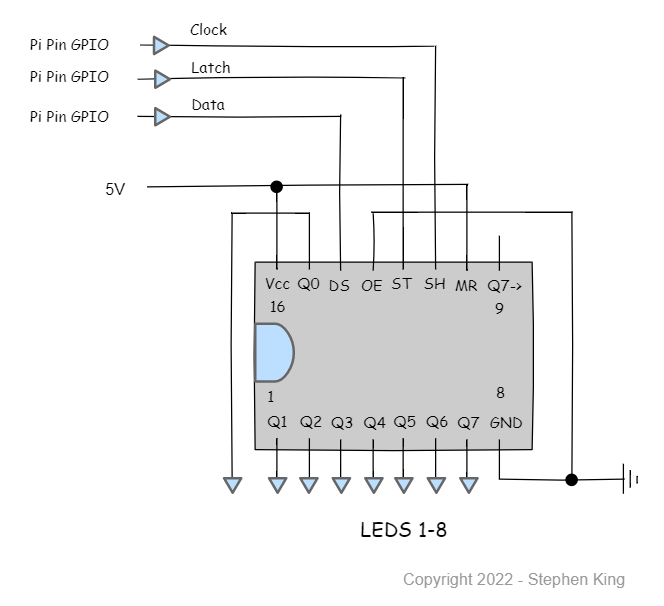
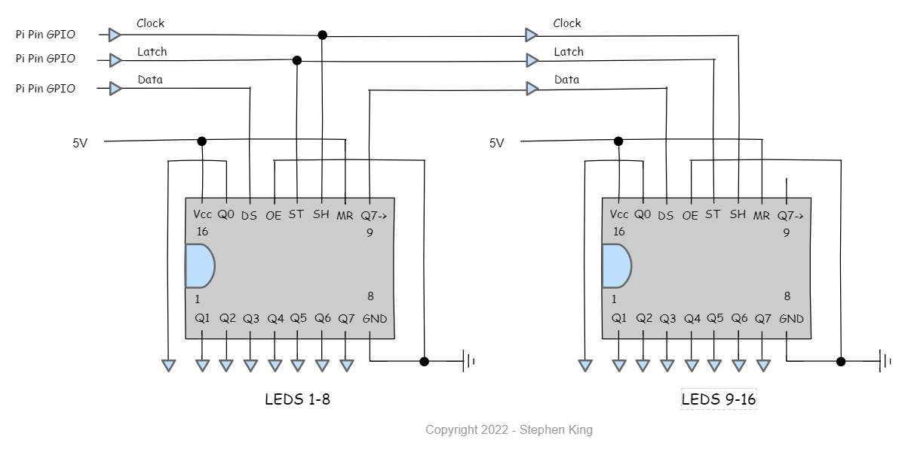

# Pizazz

> A small utility class to leverage 74HC595 shift register chips with a Raspberry Pi.

[![pre-commit][pre-commit-image]][pre-commit-url]
[![Imports: isort][isort-image]][isort-url]
[![Code style: black][black-image]][black-url]
[![Checked with mypy][mypy-image]][mypy-url]
[![security: bandit][bandit-image]][bandit-url]
[![licence: mit][mit-license-image]][mit-license-url]


The 74HC595 shift register is an incredibly useful chip. A single chip has 8 output pins which can be
controlled with only 3 input pins (excluding Vcc and Gnd of course).
That is great in itself however 595's can be daisy-chained together to give you multiples of 8 pin outputs yet still
always controlled by only 3 input pins! Wow!

If you are not sure why this is useful then let me explain.

I had a requirement to create a LED "Status Board" for a monitoring and automation application that I am also writing.
The status board would reflect the current operation status of things like Jenkins jobs, Github Actions, Linux services etc etc.
I needed a minimum of 16 LEDs. Now there already exists a [**status board**][status-board-url] HAT. However it only tracks 5 items.

Using the Raspberry [**RPi.GPIO**][rpi-gpio-url] library it is possible to individually switch the 27 GPIO pins. However each LED would require
a wire from the GPIO pin. This is very physically unwieldy and clunky to control in python.

Enter the 74HC505...

This class enables you to individually control any number of LEDS (or other output devices) with only 3 GPIO pins.

### Basic Wiring of the 74HC595 8-bit shift register to a Raspberry Pi



| Pin   | Tag     | Description                   |
| ----- | ------- | ----------------------------- |
| 1 - 7 | Q1 - Q7 | Parallel Data output pins 1-7 |
| 8     | Gnd     | Ground                        |
| 9     | Q7->    | Serial data output pin        |
| 10    | MR      | Master Reset                  |
| 11    | SH      | Clock pin                     |
| 12    | ST      | Latch pin                     |
| 13    | OE      | Output enable                 |
| 14    | DS      | Serial data input             |
| 15    | Q0      | Parallel data output pin 0    |
| 16    | Vcc     | Positive voltage supply       |

### Chaining 2 or more shift registers together



## Installation

Raspberry Pi:

```sh
pip3 install pizazz
```

## Usage example

A few motivating and useful examples of how your product can be used. Spice this up with code blocks and potentially more screenshots.

_For more examples and usage, please refer to the [Wiki][wiki]._

https://user-images.githubusercontent.com/33905365/163853342-a1a19d5e-e392-483d-845f-40bfe25d4cb3.mp4

## Release History

- v 0.1.0
  - Work in progress

## Meta

Author: Stephen R A King

Distributed under the MIT License. See `LICENSE` for more information.

[https://github.com/stephen-ra-king/pizazz](https://github.com/stephen-ra-king/pizazz)

<!-- Markdown link & img dfn's -->

[rpi-gpio-url]: https://pypi.org/project/RPi.GPIO/
[status-board-url]: https://thepihut.com/products/status-board-pro
[pre-commit-image]: https://img.shields.io/badge/pre--commit-enabled-brightgreen?logo=pre-commit&logoColor=white
[pre-commit-url]: https://github.com/pre-commit/pre-commit
[isort-image]: https://img.shields.io/badge/%20imports-isort-%231674b1?style=flat&labelColor=ef8336
[isort-url]: https://pycqa.github.io/isort/
[black-image]: https://img.shields.io/badge/code%20style-black-000000.svg
[black-url]: https://github.com/psf/black
[bandit-image]: https://img.shields.io/badge/security-bandit-yellow.svg
[bandit-url]: https://github.com/PyCQA/bandit
[mypy-image]: http://www.mypy-lang.org/static/mypy_badge.svg
[mypy-url]: http://mypy-lang.org/
[mit-license-image]: https://img.shields.io/badge/license-MIT-blue
[mit-license-url]: https://choosealicense.com/licenses/mit/
[wiki]: https://github.com/stephen-ra-king/pizazz/wiki
